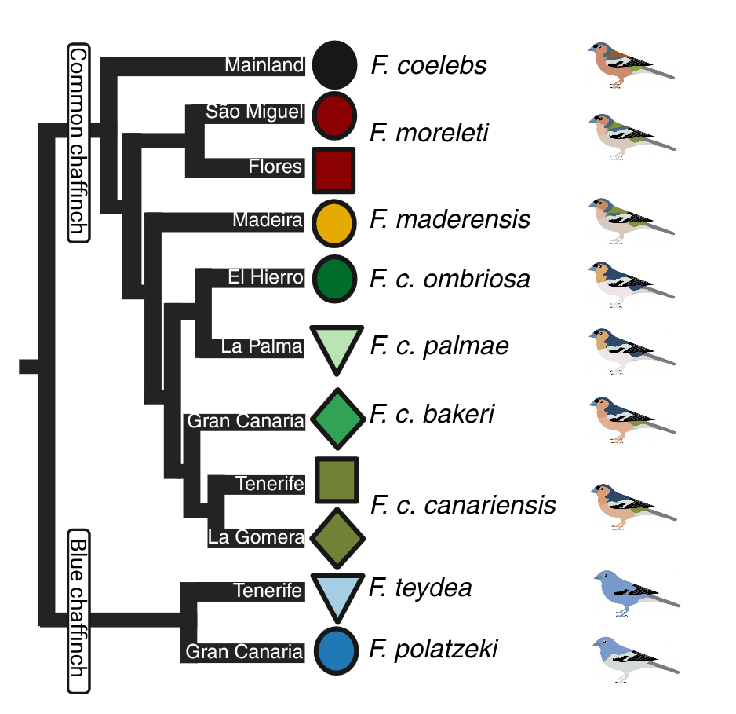

# ChaffinchMicrobiome </a>

This repository contains the scripts associated with the manuscipt "Host filtering and biogeography structure island bird gut microbiomes"

  - The "preprocessing" folder contains the code to trim, filter, denoise, assign taxonomy, OTU clustering, and rarefaction of the metabarcoding data. 
  - The "analysis" folder contains the R scripts for statistical analyses and plotting.